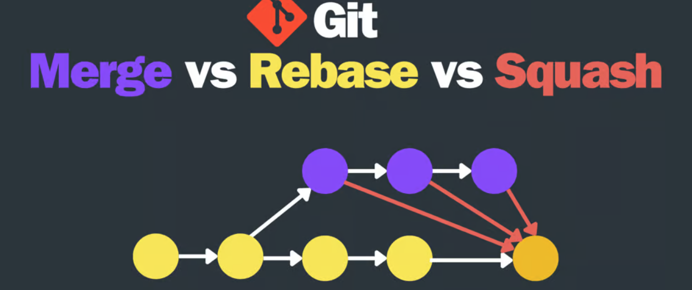
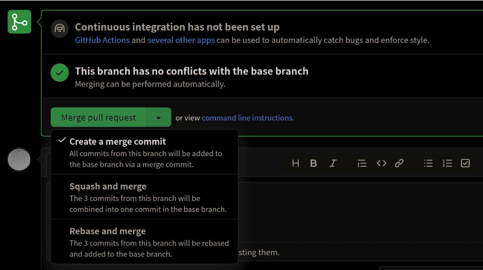
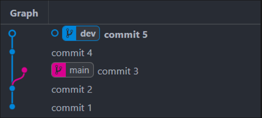
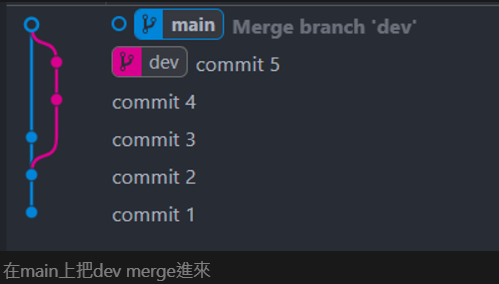

<!--more-->



## 前言

在github或gitlab合併時常常會看到以下這幾種選項



很多時候只有被同事告知選哪個就好，一開始也不太有空了解其中差別
但隨著往後可能會進入不同公司的不同開發團隊，有可能會因此需要適應不同的方案跟開發習慣
因此還是決定自己實際下過指令看看，這樣之後才會更知道哪種選項更適合當時的情境~

<!--more-->

### 檔案原始狀態:

主分支main有3筆commit: 1,2,3

開發分支dev有兩筆commit: 4,5

模擬實際開發情形，目標希望將dev開發完的新功能合併回main中。



### merge:

從目標branch拉出一條線到目前分支上，並且多長出一個commit紀錄合併內容

```jsx
// 要在main上操作
git merge dev
```



在main上把dev merge進來

### squash:

目標brach不會拉出合併的線，目前分支會多出一筆commit叫squash

```jsx
// 要在main上操作
git merge --squash dev
```


在main上merge dev

### rebase:

會把目標branch的所有commit接到base上

```jsx
// 要在dev上操作
git rebase main
```


在dev上將main重新設為基準點把自己的commit接上去

## Refference

[[Git 筆記] merge、squash、rebase 三種方式的比較](https://www.team-bob.org/git-merge-squash-rebase/)
