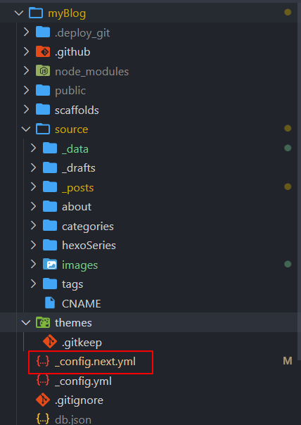
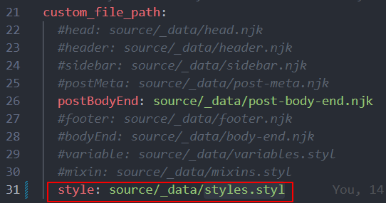
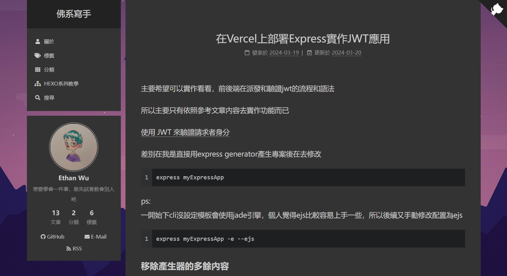

## 前言

內容很簡單而且別人文章已經寫得滿詳細，幾乎可以直接照他步驟就行

雖然我自己剛好也同樣是用這個最熱門的NEXT主題，但根據之前經驗我的檔案架構跟網路上教學文有點不太一樣所以還是稍微紀錄一下

<!--more-->

**參考文:**
[【學習筆記】如何更換 Hexo 主題 & 自訂樣式](https://heidiliu2020.github.io/hexo-theme/)

## 步驟

自己懶人包紀錄一下基本步驟還有差別

使用的主題和hexo版本:
`"hexo": "^5.0.0"`
`hexo-theme-next": "^8.6.1"`

### 主題config中打開自訂style設定

文章中`修改/themes/next/_config.yml` 檔案，把`custom_file_path`底下style部分的註解打開
⇒我自己這邊是直接去改根目錄下的`_config.next.yml`





### 新增`styles.styl`設定自訂樣式

根據上一步驟內容需要在source/_data資料夾中放入檔案

_data印象中一開始似乎沒有所以需要自己手動建立一下

文章裡的code行尾還有加上分號和註解，直接複製來用會編議失敗

拿掉後只保留css code的部分就ok了

```
body {
  background: url(/images/bg.jpg)
  background-repeat: no-repeat
  background-attachment:fixed
  background-size: cover
  background-position:50% 50%
}
```

最後記得也要把圖片放到對應位置 /source/images/bg.jpg 就可以套用成功了

成果如下:

