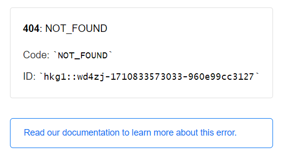
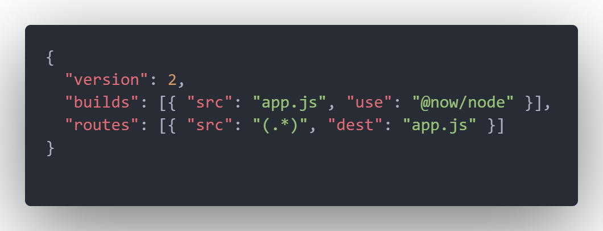

## 前言

主要希望可以實作看看，前後端在派發和驗證jwt的流程和語法

所以主要只有依照參考文章內容去實作功能而已

[使用 JWT 來驗證請求者身分](https://ken00535.medium.com/%E4%BD%BF%E7%94%A8-jwt-%E4%BE%86%E9%A9%97%E8%AD%89%E8%AB%8B%E6%B1%82%E8%80%85%E8%BA%AB%E5%88%86-285c74f4dc5c)

上述文章有提供程式碼連結可以自行參考:
[link](https://github.com/ken00535/nodejs-medium-example/tree/master/jwt)

差別在我是直接用express generator產生專案後再去修改，所以可能需要做些小調整

<!--more-->

ps:
一開始下cli忘了設定模板會使用jade引擎，個人覺得ejs比較容易上手一些，所以後續又手動修改配置為ejs

```
express myExpressApp -e --ejs
```

## 移除產生器的多餘內容

- 拿掉users相關route
- render error內容可移除


## Issues

- **local跑的時候發生cors**

	跑起來的url是用localhost，教學文章裡打api是用127.0.0.1

	兩邊改成統一就好了

- **vercel上打API沒反應**

	實際部署完後API路徑就應該要改成正式url而不是localhost不然會找不到，需要想個方法可以動態改變打API時的路徑
	
	本來打算透過.env判斷現在環境來塞進不同的值，或是把寫死的地方改為使用window.location.href之類
	
	後來發現vercel上加入環境變數後，再透過process.env帶入感覺比較簡單

- **css/main.css拿不到**

	express assest路徑會去抓public資料夾底下，裡面內建已經有幾個像是stylesheet,images,javascripts等空資料夾
把stylesheet改成css後再將檔案放入就行了

- **部署到vercel後發現畫面是404**

	

	需要加上`vercel.json`


	


## Refference

[Express 部署到 Vercel](https://israynotarray.com/nodejs/20230425/1940966356/)

